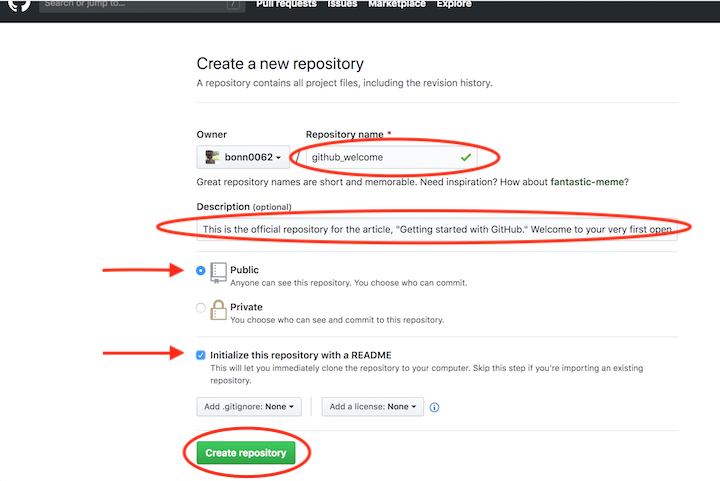
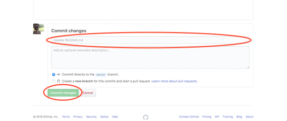

### **Вариант 2. Я вообще ничего не знаю**

Этот вариант выбирают совсем новички в разработке. Вполне возможно, у вас уже есть целая папка с файлами проекта для размещения на _GitHub_, но вы не знаете, с чего начать.

Ну что ж, приступим к делу!

Допустим, вы хотите создать новый репозиторий. Это место, где будет «жить » ваш проект. Если вы не хотите создавать новый репозиторий, то можете склонировать уже существующий. Именно так вы копируете чужой проект или берете нужную вам информацию для работы/учебы. Мы еще к этому вернемся, но чуть позже.

___Репозиторий___ — это место, в котором вы систематизируете свой проект. Здесь вы храните файлы, папки, видео, изображения, блокноты _Jupyter Notebook_, наборы данных и т.д. Перед началом работы с __Git__ необходимо инициализировать репозиторий для проекта и правильно его подготовить. Это можно сделать на сайте _GitHub_.

Лучше сразу добавлять в репозиторий ___README-файл___ с информацией о проекте. Это можно сделать в момент создания репозитория, поставив галочку в соответствующем поле.

Перейдите на сайт _GitHub_. Нажмите на значок + в верхнем правом углу, а затем выберите ___New repository.___

Придумайте имя репозитория и добавьте короткое описание.

Решите, будет ли этот репозиторий размещаться в открытом доступе или останется закрытым для просмотра.

Нажмите ___Initialize this repository with a README___ для добавления ___README-файла.___ Настоятельно рекомендую снабжать все ваши проекты файлом-описанием, ведь ___README___ — это первая вещь, на которую люди обращают внимание при просмотре репозитория. К тому же, здесь можно разместить нужную информацию для понимания или запуска проекта.

При желании можете уже сейчас начинать работать над проектом. Добавляйте файлы, вносите в них изменения и т.д. напрямую с сайта _GitHub_. Однако конечный результат подобной деятельности может вас немного огорчить.

Вносить изменения в проект можно двумя способами. Вы можете изменять файлы/блокноты на компьютере либо делать это на сайте _GitHub._

Допустим, вам захотелось подкорректировать README-файл на сайте _GitHub._

Для начала перейдите в ваш репозиторий.
Для выбора файла кликните по его названию (например, кликните по __README.md__ для перехода к файлу-описанию).

В верхнем правом углу вы увидите иконку с карандашом. Нажмите на нее для внесения изменений.

Напишите короткое сообщение, передающее суть изменений (и подробное описание, если сочтете это нужным).

Нажмите кнопку ___Commit changes.___

Вы успешно внесли изменения в ___README-файл___ своего нового репозитория! Обратите внимание на небольшую кнопку на картинке выше. Она позволяет создавать новую ветку этого коммита и добавлять ___Pull request.___ Запомните ее, скоро к ней вернемся.
Как вы видите — ничего сложного!

Лично я предпочитаю работать с файлами на локальном компьютере, а не на сайте _GitHub._ Поэтому давайте научимся и этому.

